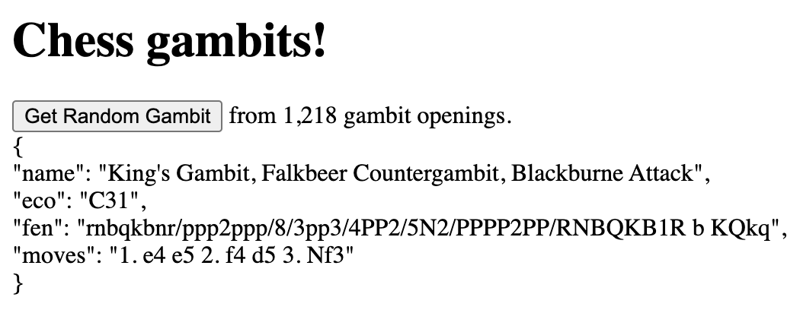

# chess_gambits
Generate a random opening gambit from the Encyclopaedia of Chess Openings (ECO).

Download the source files and open `gambit_generator.html` in your browser.
- `eco.js` has every opening in ECO. 
- `gambits.js` has every gambit opening in ECO.

